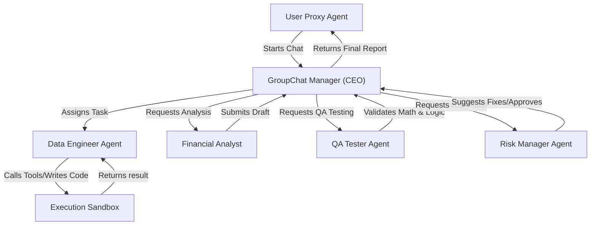
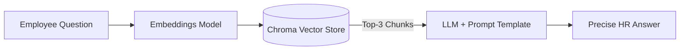
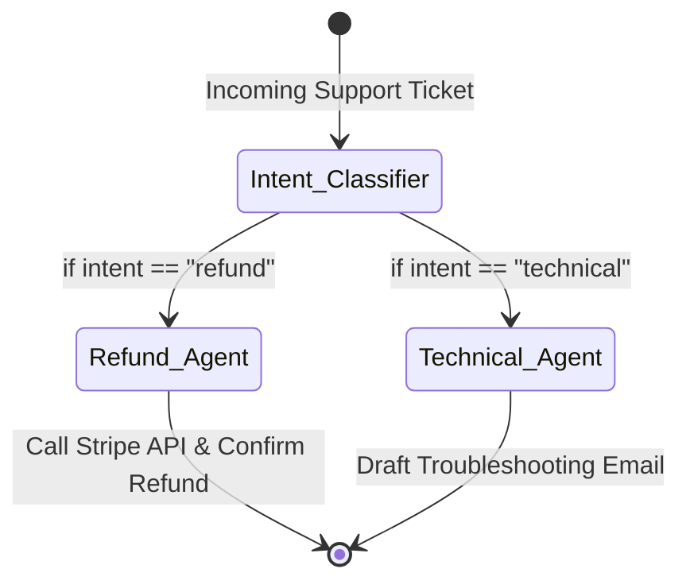
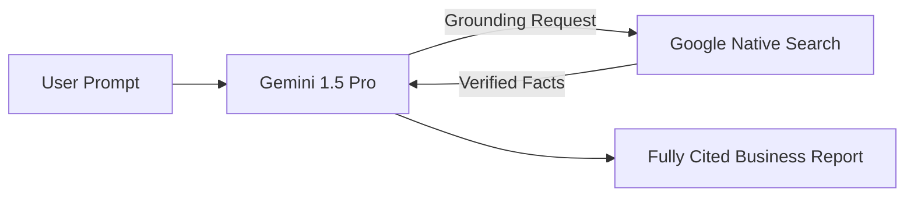
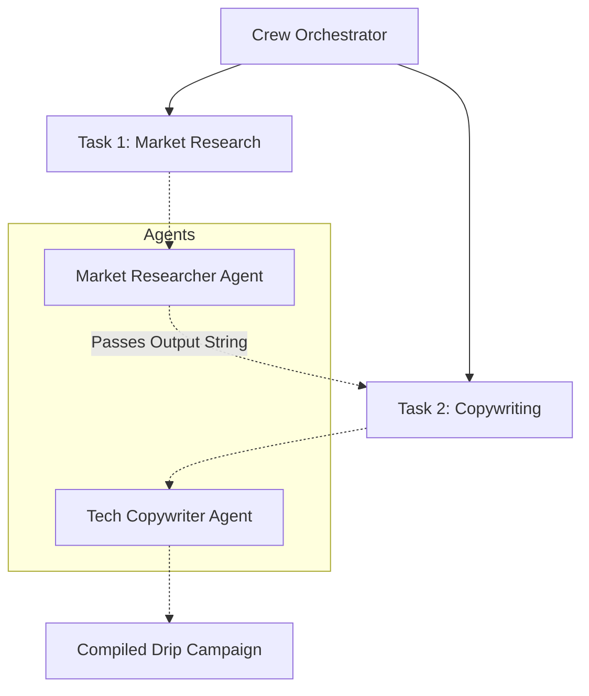
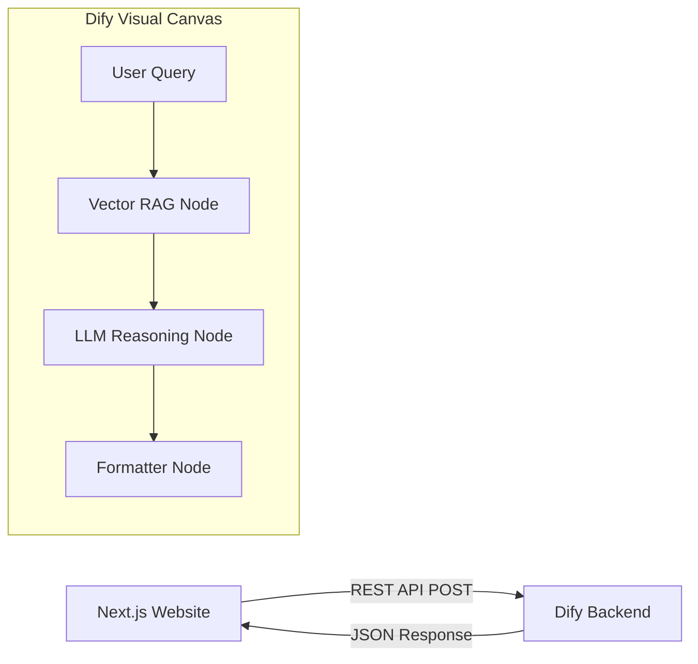

# AI Agent SDKs & Frameworks: The Master Course

Welcome to the definitive course on **AI Agent SDKs and Frameworks** (2024–2025 Edition). 

## Course Overview & Introduction

As Large Language Models (LLMs) have evolved, the focal point of AI development has shifted far beyond simple chat interfaces. The industry is rapidly moving toward building autonomous and semi-autonomous **Agents**. 

### What is an AI Agent?
An agent is an AI system that doesn't just "talk to you"—it acts on your behalf. Agents can formulate sub-plans, interact with tools (APIs, databases, web search), remember past context, self-reflect on errors, and collaborate with other agents to solve complex tasks.

### What Problem Are We Solving?
The primary problem in modern software is **Orchestration**. 
If you simply ask an LLM, "Analyze my database and tell me if we are profitable," the LLM will fail. It doesn't have the data, the code execution environment, or the memory to track a multi-step financial audit. 

To solve this, we use **Agent Frameworks**. These SDKs solve orchestration problems by:
1. Providing an environment where the LLM can write a SQL query.
2. Providing a sandbox where that SQL query is safely executed.
3. Looping the results of that query back to the LLM to analyze.
4. Returning a final formatted answer.

In this course, we will explore the major frameworks available, explicitly state the **Business Problem** they solve, fix the problem with **Code Solutions**, and break down the **Advantages and Disadvantages** of each SDK so you know exactly which tool to pick for your specific project.

---

## Course Syllabus

- **[Chapter 1: The Microsoft Ecosystem](./Chapter_1_Microsoft_Ecosystem.md)**
  Dive into *AutoGen* for multi-agent conversations, and *Semantic Kernel* for enterprise orchestration.

- **[Chapter 2: The LangChain Ecosystem](./Chapter_2_LangChain_Ecosystem.md)**
  Explore the industry-standard *LangChain* for document ingestion, and its powerful stateful graph sibling, *LangGraph*, ideal for deterministic workflows.

- **[Chapter 3: Native Provider Tooling (OpenAI & Google)](./Chapter_3_OpenAI_and_Google.md)**
  Learn about the highly optimized *OpenAI Agents SDK (Assistants API)* and Google's *Agent Development Kit (ADK)*.

- **[Chapter 4: Specialized Open-Source Frameworks](./Chapter_4_Specialized_Open_Source_Frameworks.md)**
  Discover a variety of independent frameworks solving specific problems, highlighted by *CrewAI* (role-playing teams) and *SmolAgents* (coding models).

- **[Chapter 5: Enterprise and Low-Code Platforms](./Chapter_5_Enterprise_and_Low_Code_Platforms.md)**
  Understand how non-technical and enterprise users deploy agents at scale using *Dify* and *n8n* via API integration.

Let's begin by diving into chapter 1!


# Chapter 1: The Microsoft Ecosystem

Microsoft has been at the forefront of the AI agent revolution, largely driven by its partnership with OpenAI and its robust enterprise cloud offerings. Their ecosystem caters to both hardcore researchers/developers and enterprise business users.

---

## 1. Microsoft AutoGen

### Overview
Developed by Microsoft Research, AutoGen is arguably the most famous open-source framework for building multi-agent conversations. It allows multiple LLM-backed agents to converse with one another to solve tasks, mimicking human teamwork.



### The Problem We Are Solving 
**Simulating a Fully Autonomous Financial Firm.**
A hedge fund wants to completely automate its Q3 reporting process by spinning up a digital "AI Company". A single LLM cannot code, analyze, test, and audit risks all at once without catastrophic hallucination. We need an advanced orchestration layer where 5 distinct personas—a CEO, Data Engineer, Financial Analyst, QA Tester, and Risk Manager—can literally talk to each other in a virtual group chat, debug each other's code, debate errors, and reach consensus before returning data to the human proxy.

### The Solution (Code Reference)
> 📁 **View the executable notebook here:** [`Code_Examples/Chapter1_AutoGen_Company.ipynb`](./Code_Examples/Chapter1_AutoGen_Company.ipynb)

We solve this using AutoGen's `GroupChat` feature, assigning extremely rigid system prompts to 5 different agents, and placing them in a `GroupChatManager` room to automatically execute the pipeline.

### Advantages & Disadvantages
**Advantages:**
- **Incredible conversational patterns**: Very easy to set up dynamic debates between AI personas.
- **Native code execution**: Agents can seamlessly write code, run it in a sandbox, read the terminal output, and fix their own errors.
- **Human-in-the-loop**: Excellent native hooks for requiring human approval before destructive actions.

**Disadvantages:**
- **Unpredictable Determinism**: Because agents converse freely, they can get stuck in endless chat loops saying "Thank you" to each other if not strictly prompted.
- **Steep learning curve**: Managing the state of deep, 6+ agent group chats is complex and quickly eats up token generation costs.

---

## 2. Semantic Kernel

### Overview
Semantic Kernel is an open-source SDK that makes it easy to integrate AI directly into existing C#, Python, and Java enterprise applications. It treats AI features exactly like standard dependency-injected software components.

### The Problem We Are Solving 
**Integrating AI into Legacy Business Logic.**
An enterprise CMS has an existing internal software library that changes text formats. The marketing team wants an AI tool that takes technical product specs, drafts an email, and automatically uses the *exact* legacy text formatter function before returning the result. Solving this using generic API calls is fragile; we need a framework that natively blends C#/Python logic (Skills) with AI Prompts (Semantic Functions).

### The Solution (Code Reference)
> 📁 **View the executable code here:** [`Code_Examples/Chapter1_SemanticKernel_Marketing.py`](./Code_Examples/Chapter1_SemanticKernel_Marketing.ipynb)

We use Semantic Kernel to import a native `TextSkill` alongside an OpenAI LLM, having the orchestration pipeline seamlessly execute both the AI logic and the native logic sequentially.

### Advantages & Disadvantages
**Advantages:**
- **Enterprise-ready architecture**: Feels like a true SDK engineered for massive backend systems rather than a scripting toy.
- **C# / .NET Dominance**: One of the absolute best frameworks available if your company relies heavily on Azure and .NET.
- **Goal-Oriented Planners**: Provide the Kernel with various plugins, state a goal, and the Kernel auto-generates a pipeline to achieve it.

**Disadvantages:**
- **Python Parity**: The Python version of the SDK often slightly lags behind the C# version in features.
- **Community Support**: Considerably less widespread community tutorials compared to the LangChain ecosystem.


# Chapter 2: The LangChain Ecosystem

LangChain essentially kickstarted the LLM builder movement by introducing the concept of "Chains"—linking an LLM to prompt templates, API tools, and local databases. As the ecosystem matured, the core team released **LangGraph** to handle highly complex, persistent hierarchical state machines.

---

## 1. LangChain (Core)

### Overview
LangChain is a highly modular open-source framework emphasising the standardisation of components. It provides foundational abstractions for prompts, memory, document loaders, vector stores, and simple chains.

### The Problem We Are Solving
**Internal HR Document Question/Answering (RAG).**
A company wants to deploy an internal HR chatbot. However, public LLMs do not know the company's private vacation policies. Furthermore, passing an entire 500-page PDF into an LLM window every time is too expensive and exceeds token limits. We need a system to parse the document, search for only the relevant paragraphs, and pass *just those paragraphs* into the LLM context window.



### The Solution (Code Reference)
> 📁 **View the executable notebook here:** [`Code_Examples/Chapter2_LangChain_HR_RAG.ipynb`](./Code_Examples/Chapter2_LangChain_HR_RAG.ipynb)

We solve this using a RAG (Retrieval-Augmented Generation) pipeline. LangChain's `RecursiveCharacterTextSplitter` chunks the source text, `OpenAIEmbeddings` vectorises the chunks into a `Chroma` in-memory vector store, and a `RetrievalChain` fetches only the top-3 most relevant policy paragraphs before passing them to the LLM. The model answers strictly from the retrieved context, preventing hallucinations.

### Advantages & Disadvantages
**Advantages:**
- **Massive Tooling Ecosystem**: Over a thousand pre-built integrations for AWS, Slack, Google Drive, SQL databases, and more.
- **Provider Agnosticism**: Switching from OpenAI to Anthropic requires changing exactly one line of code.
- **RAG Domination**: Phenomenal built-in utilities for text-splitting, vectorisation, and retrieval algorithms.

**Disadvantages:**
- **Over-abstraction**: When something breaks inside a chain, debugging can be notoriously difficult due to deeply nested abstractions.
- **Rapid Breaking Changes**: The framework evolves so quickly that code written 12 months ago often requires heavy refactoring today.

---

## 2. LangGraph

### Overview
LangGraph models agents as **stateful graphs (or finite state machines)**. While classical LangChain is great for simple A-to-B questions, LangGraph handles multi-step workflows where an agent must explicitly route requests to specialised sub-agents depending on intent—and is physically incapable of taking an undefined path.



### The Problem We Are Solving
**Deterministic Customer Support Routing & Action.**
An e-commerce company receives thousands of support tickets daily. They need an agent that reliably classifies intent: if it's a refund request, it must trigger the Stripe API; if it's a technical issue, it must draft a precise troubleshooting email. A plain LLM will hallucinate routing paths or skip steps. We need strict Graph-Theory-based routing to guarantee the correct execution path every single time.

### The Solution (Code Reference)
> 📁 **View the executable notebook here:** [`Code_Examples/Chapter2_LangGraph_Support.ipynb`](./Code_Examples/Chapter2_LangGraph_Support.ipynb)

We define the workflow as explicitly coded nodes (Python functions) and conditional edges (routing logic). The `StateGraph` is compiled into an immutable execution graph. The `Intent Classifier` node classifies intent, and the `route_ticket` edge function deterministically dispatches to either `Refund_Agent` or `Technical_Agent`. The system is physically incapable of routing a refund query to the technical support path.

### Advantages & Disadvantages
**Advantages:**
- **Total Determinism**: You explicitly define every edge. If a node is not connected, the agent cannot hallucinate a path to it—critical for legal and financial compliance.
- **Time Checkpointing**: LangGraph saves state at every node. If an API call times out at step 5, you can resume execution directly from step 5.
- **Production Grade**: Built for horizontal scaling and enterprise deployments.

**Disadvantages:**
- **Steep Learning Curve**: Requires solid knowledge of Graph Theory, TypedDicts, and stateful dictionary manipulation.
- **Verbosity**: Setting up even simple applications takes significantly more boilerplate than a standard LangChain chain.


# Chapter 3: Native Provider Tooling (OpenAI & Google)

Instead of relying on third-party middleware frameworks, major model providers are creating direct APIs to manage agentic workflows. These are highly optimized and require virtually zero infrastructure setup.

---

## 1. OpenAI Assistants API & Agents SDK

### Overview
The OpenAI Assistants API is a persistent, stateful system managed completely on OpenAI's servers. You don't need to pass all conversation history back and forth manually; OpenAI stores it natively in a managed "Thread". 

### The Problem We Are Solving 
**Virtual Data Scientist with Native Environment.**
A sales manager wants to upload a raw CSV containing millions of rows of data and have an AI analyze it, run statistical operations, and plot a chart. Building an orchestration layer from scratch requires spinning up secure, containerized Python sandboxes to run the LLM's code safely. We need an out-of-the-box managed framework that handles the infra for us.

### The Solution (Code Reference)
> 📁 **View the executable code here:** [`Code_Examples/Chapter3_OpenAI_DataScientist.py`](./Code_Examples/Chapter3_OpenAI_DataScientist.ipynb)

We use the Assistants API with the native `code_interpreter` tool, entirely skipping local infrastructure setup. OpenAI automatically manages the Python execution sandbox on their servers.

### Advantages & Disadvantages
**Advantages:**
- **Zero Infra Ops**: You never have to build a vector database for RAG or a Docker container to safely execute Python code. OpenAI manages the sandboxes.
- **Infinite Threads**: Because OpenAI stores the history, you save massive amounts of local computational overhead and network payloads.
- **Agent Handoffs**: The emerging Agents SDK provides flawless primitives for seamlessly transferring users between specialized agents.

**Disadvantages:**
- **Total Vendor Lock-In**: If you write your app heavily relying on the Assistants API, migrating to a local model or Anthropic Claude later is monumentally difficult.
- **Black-Box RAG**: When the agent searches files natively, you cannot configure the underlying retrieval algorithm (e.g., tweaking chunk sizes or vector strategies).

---

## 2. Google Agent Development Kit (ADK) & Vertex AI

### Overview
Introduced to support the massive Gemini ecosystem, Google ADK provides software-engineering-first primitives to build production-grade enterprise agents natively on Google Cloud. 



### The Problem We Are Solving 
**Enterprise Grounding to Eliminate Hallucinations.**
A tech enterprise needs to summarize long, highly technical engineering bug reports for management. Because LLMs suffer from "hallucination"—sometimes inventing fake technical terms when they lack context—the enterprise requires 100% adherence to actual internet facts. We need an agent that is forced to cross-reference data over Google Search before replying.

### The Solution (Code Reference)
> 📁 **View the executable code here:** [`Code_Examples/Chapter3_GoogleADK_Enterprise.py`](./Code_Examples/Chapter3_GoogleADK_Enterprise.ipynb)

We leverage Vertex AI's native `GoogleSearchRetrieval` grounding tool, which instantly anchors the LLM's response to verified Google index results, providing precise metadata citations to audit.

### Advantages & Disadvantages
**Advantages:**
- **Unbeatable Grounding**: Unrivaled integration with Google's native search engine to verify facts and explicitly cite sources.
- **Massive Context Windows**: Utilizing Gemini 1.5 Pro allows sending an entire 3-hour video or massive codebases (1M+ tokens) to the agent in one blast.
- **Cloud-Scale Observability**: Hooks directly into Google Cloud Logging and Operations suite seamlessly.

**Disadvantages:**
- **Ecosystem Constraint**: Requires functioning securely within the Google Cloud Platform (GCP) ecosystem, making it less ideal for AWS exclusively hosted companies.
- **Less Community Proliferation**: The open-source community provides fewer plug-and-play tutorials compared to LangChain.


# Chapter 4: Specialized Open-Source Frameworks

Beyond the major tech giants, independent open-source projects are solving very specific AI Agent paradigms. These frameworks often command immense community popularity.

---

## 1. CrewAI

### Overview
CrewAI is an incredibly popular framework designed specifically for orchestrating role-playing AI agents. You assemble a "Crew" of agents, give them specific backgrounds, and watch them execute hierarchical or sequential tasks.



### The Problem We Are Solving 
**Automated Marketing Campaign Creation in Startups.**
A boutique agency needs to generate multi-faceted ad campaigns rapidly. Building complex LangGraph architecture with nodes and edges takes weeks. They want a framework where they can speak in "Plain English" to define who the team members are (A Researcher, a Writer) and just hand them a list of tasks to execute collaboratively. To solve this, we need an abstraction that maps "Roles and Goals" directly into multi-agent workflows.

### The Solution (Code Reference)
> 📁 **View the executable code here:** [`Code_Examples/Chapter4_CrewAI_Marketing.py`](./Code_Examples/Chapter4_CrewAI_Marketing.ipynb)

We define the Agents, define the Tasks natively in Python, assemble them into a Crew, and instruct them to execute sequentially, handling all internal state management silently.

### Advantages & Disadvantages
**Advantages:**
- **Exceptionally Intuitive API**: Allows product managers and prompt engineers to formulate team structures with near-zero software engineering friction.
- **Dynamic Context Passing**: Automatically handles passing the output from one agent’s task into the input of the next agent's task natively.
- **Rapid Prototyping**: Excellent for creative text generation out-of-the-box.

**Disadvantages:**
- **Lack of Deterministic Control**: Since agents operate largely on their system prompts instead of strict coded execution paths, they can be highly prone to erratic deviations or repetitive loops.
- **Production Scalability**: Very difficult to scale gracefully horizontally compared to independent LangGraph microservices.

---

## 2. SmolAgents (Hugging Face)

### Overview
A radically minimalist Python library from Hugging Face that aggressively prioritizes lightweight execution and LLM Code-generation.

### The Problem We Are Solving 
**Fast, Cost-Effective Computational Processing.**
A hobbyist data scientist needs a lightweight agent to compute complex compounding financial math, but standard LLMs fail at math inherently. Furthermore, they don't want to export their raw data to OpenAI's expensive API. They need a system that pulls a free, open-source model which forces the agent to *write local python code to solve math problems* rather than trying to guess the answer.

### The Solution (Code Reference)
> 📁 **View the executable code here:** [`Code_Examples/Chapter4_SmolAgents_Math.py`](./Code_Examples/Chapter4_SmolAgents_Math.ipynb)

By leveraging SmolAgents, the agent's absolute default behavior is to output executable python blocks. The framework runs the block and returns the exact math answer perfectly reliably.

### Advantages & Disadvantages
**Advantages:**
- **Code-First Architecture**: Fundamentally avoids LLM math-hallucinations by enforcing code execution as a core primitive.
- **Extremely Minimalist**: The source code is thin, reducing bloat, and making the underlying mechanics extremely easy to audit.
- **Hugging Face Synced**: Best-in-class integration with thousands of completely free models available on the HF Hub.

**Disadvantages:**
- **Scope limitation**: Not designed to orchestrate complex corporate workflows, RAG systems, or deep API routing logic.
- **Tooling Constraints**: Smaller built-in tool library compared to LangChain plugins.

---

*(Other specialized frameworks include **LlamaIndex Workflows** for deep asynchronous document processing, and **Letta** for OS-level infinite memory retention).*


# Chapter 5: Enterprise, Low-Code, and No-Code Platforms

The transition from code-heavy Python SDKs to scalable, visual workflow builders allows business operations, non-technical founders, and enterprise teams to deploy AI logic rapidly and securely.

While these platforms are "low code" via the UI, they are predominantly consumed by frontend developers via robust REST APIs.

---

## 1. Dify

### Overview
Dify provides a visual canvas web-interface for building agents. You drag and drop nodes, define prompt templates, test the output, and attach vector databases all through a sleek UI. 



### The Problem We Are Solving 
**Bridging Non-Tech Product Managers with Frontend Engineering.**
A non-technical product manager wants to design an intricate, 15-step "Lead Qualification Agent" that references pricing PDFs, and wants to A/B test prompts easily. If developers write this in raw Python (LangChain), the PM has to open Pull Requests just to tweak a prompt. We need a system where the PM manages the Agent visually, and the Frontend Developer simply embeds the final AI output into the company Website.

### The Solution (Code Reference)
> 📁 **View the executable code here:** [`Code_Examples/Chapter5_Dify_API.py`](./Code_Examples/Chapter5_Dify_API.ipynb)

We solve this by using Dify as a visual "Backend-as-a-Service". The developer executes a simple REST API POST call from their Next.js/Python server to interact with the PM's visually completed Agent.

### Advantages & Disadvantages
**Advantages:**
- **Workflow Decoupling**: Separation of concerns allows prompt engineers to iterate independently of software engineers, vastly speeding up iteration.
- **Visual Clarity**: Drag-and-drop RAG and workflow nodes make tracking complex logic incredibly easy compared to reading 500 lines of python code.
- **Multi-Model**: Instantly swap the engine from OpenAI to local HuggingFace models using dropdown menus.

**Disadvantages:**
- **Infrastructure Overhead**: Self-hosting Dify requires maintaining Postgres, Redis, Vector Databases, and dozens of Docker containers.
- **Granular Flexibility**: Lacks the deep deterministic low-level control of writing custom edge constraints natively in Python.

---

## 2. Zapier Central & n8n

### Overview
Traditional automation pioneers have embedded Agents forcefully into their DNA. 
- **Zapier Central**: Connects AI to 6,000+ app integrations via English commanding.
- **n8n**: A more technical, self-hostable open-source visual workflow automation tool allowing LLM triggers.

### The Problem We Are Solving 
**Asynchronous Enterprise SaaS Data Routing.**
A company handles thousands of incoming support desk emails. They need an automated agent that reads an email when it arrives, assesses the emotional sentiment (Angry vs Calm), and if "Angry", immediately routes an alert to a specific Slack channel. Solving this by building a background Python queue worker from scratch is tedious. We need a visual tool designed natively for asynchronous event processing.

### The Solution (Code Reference)
> 📁 **View the executable code here:** [`Code_Examples/Chapter5_n8n_Webhook.sh`](./Code_Examples/Chapter5_n8n_Webhook.sh)

We solve this using **n8n Webhooks**. An n8n developer strings a webhook node visually to an AI node. External systems just POST a payload to the webhook, and the visual Agent UI takes over automatically from there.

### Advantages & Disadvantages
**Advantages:**
- **Unrivaled Integrations**: The sheer volume of pre-configured API connectors to services like Salesforce, Jira, and Slack is unparalleled.
- **Event-Driven**: Automatically built to sleep and wake-up based on asynchronous hooks (emails arriving, rows updating in a spreadsheet).
- **Accessibility**: Nearly zero formal backend code required.

**Disadvantages:**
- **Cost at Scale**: Hosted Zapier execution charges per "task run", which becomes prohibitively expensive at enterprise scales.
- **Weak for Deep Reasoning**: While great for shuffling data between apps, they are generally poor at complex, multi-agent cyclical reasoning loops compared to dedicated Agent SDKs like LangGraph.


# Chapter 6: Observability & Tracing

While building AI Agents in a sandbox is exciting, deploying them to production introduces massive engineering challenges. The biggest of these challenges is understanding *why* an agent made a specific decision.

---

## The "Black Box" Problem

### Overview
When a standard software application fails, developers look at the stack trace. When an AI Agent fails, there is no stack trace. You simply receive an automated message saying "I couldn't complete the task." 

Did the LLM fail to retrieve the right document? Did the API tool timeout? Did the prompt template compile incorrectly? Or did the LLM simply hallucinate? Without explicit **Observability**, Agents are a "black box".

### The Problem We Are Solving 
**Debugging Silent Agent Failures.**
An enterprise pushes a LangGraph agent to production to handle customer refunds. Suddenly, 10% of refunds fail. A developer needs to see the *exact* sequence of hidden LLM calls, the precise token count used, the exact latency of the web-search tool, and the finalized prompt string sent to the OpenAI API for every single user interaction. 

### The Solution (Code Reference)
The industry standard solution is to inject **Tracing Decorators** into the agent logic. Tools like **LangSmith** (by LangChain) and **Arize Phoenix** (open-source) act as the "Datadog" of AI Agents. 

Here is how you trivially enable LangSmith tracing for a LangChain application using Environment Variables:

```python
import os
from langchain_openai import ChatOpenAI

# 1. Enable tracing with 3 simple environment variables
os.environ["LANGCHAIN_TRACING_V2"] = "true"
os.environ["LANGCHAIN_ENDPOINT"] = "https://api.smith.langchain.com"
os.environ["LANGCHAIN_API_KEY"] = "YOUR_LANGSMITH_KEY"
os.environ["LANGCHAIN_PROJECT"] = "Customer_Refund_Agent"

os.environ["OPENAI_API_KEY"] = "YOUR_OPENAI_KEY"

# 2. Execute standard agent logic
llm = ChatOpenAI(model="gpt-4-turbo")
response = llm.invoke("Assess this refund request: 'Item arrived broken.'")

print(response.content)

# 3. Behind the scenes:
# Because tracing is enabled, LangSmith intercepts the API call, measures the latency (e.g. 1.2s), 
# counts the tokens (e.g. 450 tokens), logs the exact prompt text, and sends it to your LangSmith Dashboard.
```

If you prefer an open-source, locally hosted solution without exporting telemetry to LangChain servers, you can use **Arize Phoenix**:

```python
import phoenix as px
from openinference.instrumentation.langchain import LangChainInstrumentor

# 1. Launch a local Phoenix telemetry UI dashboard on port 6006
session = px.launch_app()

# 2. Instrument (Hook) into LangChain
LangChainInstrumentor().instrument()

# 3. All LLM calls, Agent Steps, and Tool retrievals are now visually tracked in the browser.
```

### Advantages & Disadvantages of Tracing Platforms
**Advantages:**
- **Visual Debugging**: You can click on a failed user interaction in a web dashboard and expand a waterfall tree of every sub-agent, tool, and LLM call made behind the scenes.
- **Cost Analysis**: Granular tracking of exactly how much money (token count) a specific Agent feature is costing you.
- **A/B Testing**: You can trace two different system prompts sequentially and compare the exact latency and accuracy of the responses automatically evaluated by another LLM.

**Disadvantages:**
- **Latency Overhead**: Instrumenting heavy tracing wrappers can sometimes introduce minor latency to API responses.
- **Data Privacy**: Using hosted solutions like LangSmith requires sending sensitive user prompt payload data to third-party dashboards (though enterprise self-hosting exists).


