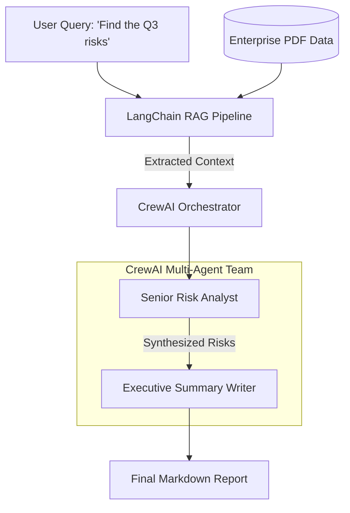

# The Automated Enterprise Researcher (Capstone Project)

Welcome to the Capstone Project! In chapters 1 through 5, we explored isolated SDKs. In the real world, enterprise architectures often combine the strengths of multiple frameworks to create a robust system.

## The Architecture

**Goal:** Create a system that retrieves highly specific financial data from a private enterprise PDF, and then hands that data over to a team of intelligent agents to debate, synthesize, and write an executive briefing.

We will combine two frameworks:
1. **LangChain**: The undisputed king of RAG (Retrieval-Augmented Generation). We will use LangChain to parse an enterprise PDF, vectorize it, and extract the exact paragraphs related to our query.
2. **CrewAI**: Excellent for role-playing orchestration. Once LangChain finds the text, we will inject it directly into the initial context of a CrewAI `Task`. The Crew consists of a *Senior Risk Analyst* and an *Executive Summary Writer* who collaborate to output the final brief.

## How to Run
Execute the Jupyter Notebook `main_orchestrator.ipynb` block-by-block. Ensure your `.env` file is populated with your `OPENAI_API_KEY`.
