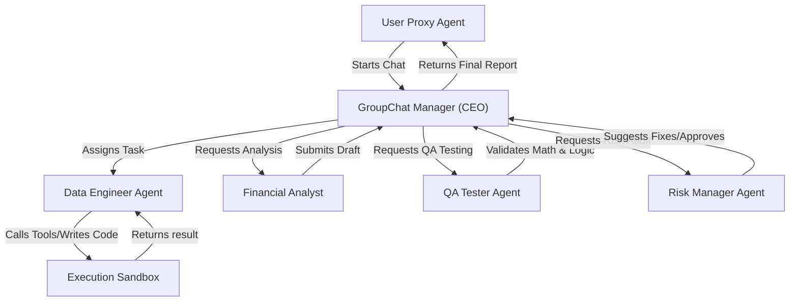

# Chapter 1: The Microsoft Ecosystem

Microsoft has been at the forefront of the AI agent revolution, largely driven by its partnership with OpenAI and its robust enterprise cloud offerings. Their ecosystem caters to both hardcore researchers/developers and enterprise business users.

---

## 1. Microsoft AutoGen

### Overview
Developed by Microsoft Research, AutoGen is arguably the most famous open-source framework for building multi-agent conversations. It allows multiple LLM-backed agents to converse with one another to solve tasks, mimicking human teamwork.

### The Problem We Are Solving 
**Simulating a Fully Autonomous Financial Firm.**
A hedge fund wants to completely automate its Q3 reporting process by spinning up a digital "AI Company". A single LLM cannot code, analyze, test, and audit risks all at once without catastrophic hallucination. We need an advanced orchestration layer where 5 distinct personas—a CEO, Data Engineer, Financial Analyst, QA Tester, and Risk Manager—can literally talk to each other in a virtual group chat, debug each other's code, debate errors, and reach consensus before returning data to the human proxy.

### The Solution (Code Reference)
> 📁 **View the executable notebook here:** [`Code_Examples/Chapter1_AutoGen_Company.ipynb`](./Code_Examples/Chapter1_AutoGen_Company.ipynb)

We solve this using AutoGen's `GroupChat` feature, assigning extremely rigid system prompts to 5 different agents, and placing them in a `GroupChatManager` room to automatically execute the pipeline.

### Advantages & Disadvantages
**Advantages:**
- **Incredible conversational patterns**: Very easy to set up dynamic debates between AI personas.
- **Native code execution**: Agents can seamlessly write code, run it in a sandbox, read the terminal output, and fix their own errors.
- **Human-in-the-loop**: Excellent native hooks for requiring human approval before destructive actions.

**Disadvantages:**
- **Unpredictable Determinism**: Because agents converse freely, they can get stuck in endless chat loops saying "Thank you" to each other if not strictly prompted.
- **Steep learning curve**: Managing the state of deep, 6+ agent group chats is complex and quickly eats up token generation costs.

---

## 2. Semantic Kernel

### Overview
Semantic Kernel is an open-source SDK that makes it easy to integrate AI directly into existing C#, Python, and Java enterprise applications. It treats AI features exactly like standard dependency-injected software components.

### The Problem We Are Solving 
**Integrating AI into Legacy Business Logic.**
An enterprise CMS has an existing internal software library that changes text formats. The marketing team wants an AI tool that takes technical product specs, drafts an email, and automatically uses the *exact* legacy text formatter function before returning the result. Solving this using generic API calls is fragile; we need a framework that natively blends C#/Python logic (Skills) with AI Prompts (Semantic Functions).

### The Solution (Code Reference)
> 📁 **View the executable code here:** [`Code_Examples/Chapter1_SemanticKernel_Marketing.py`](./Code_Examples/Chapter1_SemanticKernel_Marketing.ipynb)

We use Semantic Kernel to import a native `TextSkill` alongside an OpenAI LLM, having the orchestration pipeline seamlessly execute both the AI logic and the native logic sequentially.

### Advantages & Disadvantages
**Advantages:**
- **Enterprise-ready architecture**: Feels like a true SDK engineered for massive backend systems rather than a scripting toy.
- **C# / .NET Dominance**: One of the absolute best frameworks available if your company relies heavily on Azure and .NET.
- **Goal-Oriented Planners**: Provide the Kernel with various plugins, state a goal, and the Kernel auto-generates a pipeline to achieve it.

**Disadvantages:**
- **Python Parity**: The Python version of the SDK often slightly lags behind the C# version in features.
- **Community Support**: Considerably less widespread community tutorials compared to the LangChain ecosystem.
