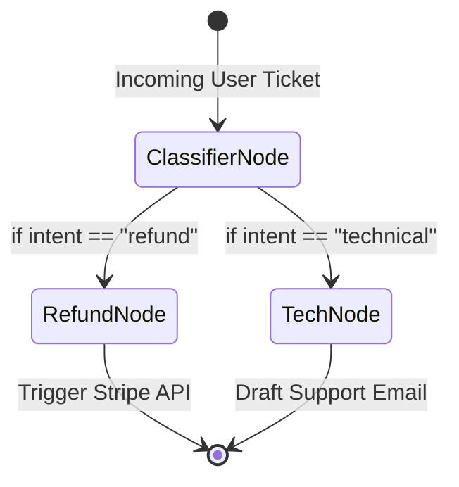

# Chapter 2: The LangChain Ecosystem

LangChain essentially kickstarted the LLM builder movement by introducing the concept of "Chains"—linking an LLM to prompt templates, API tools, and local databases. As the ecosystem matured, the core team released LangGraph to handle highly complex, persistent agentic state machines.

---

## 1. LangChain (Core)

### Overview
LangChain is a highly modular open-source framework emphasizing the standardization of components. It provides foundational abstractions for prompts, memory, document loaders, vector stores, and simple chains.

### The Problem We Are Solving 
**Internal HR Document Question/Answering (RAG).**
A company wants to deploy an internal HR chatbot. However, public LLMs do not know the company's private vacation policies. Furthermore, passing an entire 500-page PDF into an LLM window every time is too expensive and exceeds token limits. We need a system to parse the PDF, search for only the relevant paragraphs, and pass *just those paragraphs* into the LLM context wrapper.

### The Solution (Code Reference)
> 📁 **View the executable code here:** [`Code_Examples/Chapter2_LangChain_HR_RAG.py`](./Code_Examples/Chapter2_LangChain_HR_RAG.py)

We solve this using a RAG (Retrieval-Augmented Generation) pipeline using LangChain's pre-built Data Loaders, Vectorstores, and Retrieval Chains to query local documents securely.

### Advantages & Disadvantages
**Advantages:**
- **Massive Tooling Ecosystem**: Over a thousand pre-built integrations for connecting to AWS, Slack, Google Drive, SQL DBs, and more.
- **Provider Agnosticism**: Switching from OpenAI to Anthropic requires changing exactly one line of code.
- **RAG Domination**: Phenomenal built-in utilities for text-splitting, vectorization, and retrieval algorithms.

**Disadvantages:**
- **Over-abstraction**: Because it abstracts so much, when something breaks inside a chain, it can be notoriously difficult to debug.
- **Rapid Breaking Changes**: The framework moves so quickly that code written 12 months ago often requires heavy refactoring today.

---

## 2. LangGraph

### Overview
LangGraph models agents as **stateful graphs (or finite state machines)**. While LangChain is great for A-to-B linear chains, LangGraph handles workflows where an agent might fail at task C, loop back to task A, retry, and then proceed to D.

### The Problem We Are Solving 
**Deterministic Customer Support Routing & Action.**
An e-commerce company receives thousands of support tickets. They need an agent that reliably looks at intent. If it's a refund request, it must execute code to hit the Stripe API. If it's technical support, it must draft a troubleshooting email. Normal LLMs will hallucinate or skip steps. We need strict software-engineering routing (Graph workflow) to guarantee it takes the right path safely.

### The Solution (Code Reference)
> 📁 **View the executable code here:** [`Code_Examples/Chapter2_LangGraph_Support.py`](./Code_Examples/Chapter2_LangGraph_Support.py)

We define the workflow as explicitly coded nodes representing actions, and edges representing conditional logic, ensuring completely deterministic execution pathways.

### Advantages & Disadvantages
**Advantages:**
- **Total Determinism**: You explicitly define the "edges". If you don't connect a node, the agent physically cannot hallucinate a path there.
- **Time Checkpointing**: Saves state at every node. If an API times out on step 5, you can resume execution directly from processing step 5.
- **Production Grade**: Extremely scalable and built for enterprise deployments.

**Disadvantages:**
- **Steep Learning Curve**: Requires knowledge of Graph Theory and stateful dictionary manipulation.
- **Verbosity**: Setting up simple applications takes vastly more boilerplate code than a standard LangChain chain.
