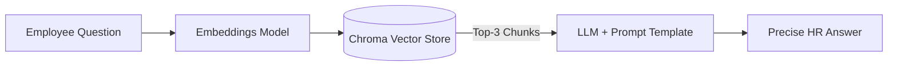
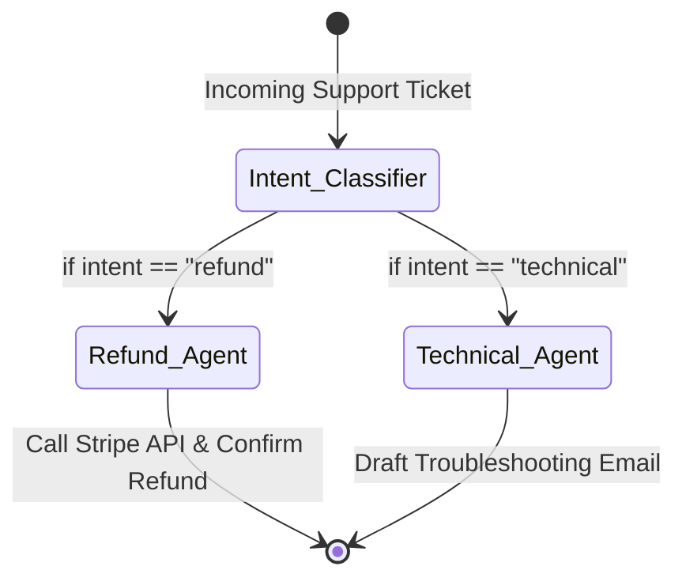

# Chapter 2: The LangChain Ecosystem

LangChain essentially kickstarted the LLM builder movement by introducing the concept of "Chains"—linking an LLM to prompt templates, API tools, and local databases. As the ecosystem matured, the core team released **LangGraph** to handle highly complex, persistent hierarchical state machines.

---

## 1. LangChain (Core)

### Overview
LangChain is a highly modular open-source framework emphasising the standardisation of components. It provides foundational abstractions for prompts, memory, document loaders, vector stores, and simple chains.

### The Problem We Are Solving
**Internal HR Document Question/Answering (RAG).**
A company wants to deploy an internal HR chatbot. However, public LLMs do not know the company's private vacation policies. Furthermore, passing an entire 500-page PDF into an LLM window every time is too expensive and exceeds token limits. We need a system to parse the document, search for only the relevant paragraphs, and pass *just those paragraphs* into the LLM context window.

### The Solution (Code Reference)
> 📁 **View the executable notebook here:** [`Code_Examples/Chapter2_LangChain_HR_RAG.ipynb`](./Code_Examples/Chapter2_LangChain_HR_RAG.ipynb)

We solve this using a RAG (Retrieval-Augmented Generation) pipeline. LangChain's `RecursiveCharacterTextSplitter` chunks the source text, `OpenAIEmbeddings` vectorises the chunks into a `Chroma` in-memory vector store, and a `RetrievalChain` fetches only the top-3 most relevant policy paragraphs before passing them to the LLM. The model answers strictly from the retrieved context, preventing hallucinations.

### Advantages & Disadvantages
**Advantages:**
- **Massive Tooling Ecosystem**: Over a thousand pre-built integrations for AWS, Slack, Google Drive, SQL databases, and more.
- **Provider Agnosticism**: Switching from OpenAI to Anthropic requires changing exactly one line of code.
- **RAG Domination**: Phenomenal built-in utilities for text-splitting, vectorisation, and retrieval algorithms.

**Disadvantages:**
- **Over-abstraction**: When something breaks inside a chain, debugging can be notoriously difficult due to deeply nested abstractions.
- **Rapid Breaking Changes**: The framework evolves so quickly that code written 12 months ago often requires heavy refactoring today.

---

## 2. LangGraph

### Overview
LangGraph models agents as **stateful graphs (or finite state machines)**. While classical LangChain is great for simple A-to-B questions, LangGraph handles multi-step workflows where an agent must explicitly route requests to specialised sub-agents depending on intent—and is physically incapable of taking an undefined path.

### The Problem We Are Solving
**Deterministic Customer Support Routing & Action.**
An e-commerce company receives thousands of support tickets daily. They need an agent that reliably classifies intent: if it's a refund request, it must trigger the Stripe API; if it's a technical issue, it must draft a precise troubleshooting email. A plain LLM will hallucinate routing paths or skip steps. We need strict Graph-Theory-based routing to guarantee the correct execution path every single time.

### The Solution (Code Reference)
> 📁 **View the executable notebook here:** [`Code_Examples/Chapter2_LangGraph_Support.ipynb`](./Code_Examples/Chapter2_LangGraph_Support.ipynb)

We define the workflow as explicitly coded nodes (Python functions) and conditional edges (routing logic). The `StateGraph` is compiled into an immutable execution graph. The `Intent Classifier` node classifies intent, and the `route_ticket` edge function deterministically dispatches to either `Refund_Agent` or `Technical_Agent`. The system is physically incapable of routing a refund query to the technical support path.

### Advantages & Disadvantages
**Advantages:**
- **Total Determinism**: You explicitly define every edge. If a node is not connected, the agent cannot hallucinate a path to it—critical for legal and financial compliance.
- **Time Checkpointing**: LangGraph saves state at every node. If an API call times out at step 5, you can resume execution directly from step 5.
- **Production Grade**: Built for horizontal scaling and enterprise deployments.

**Disadvantages:**
- **Steep Learning Curve**: Requires solid knowledge of Graph Theory, TypedDicts, and stateful dictionary manipulation.
- **Verbosity**: Setting up even simple applications takes significantly more boilerplate than a standard LangChain chain.
