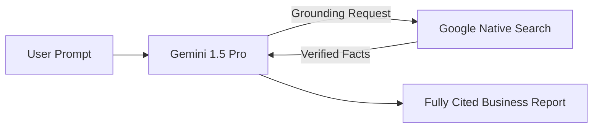

# Chapter 3: Native Provider Tooling (OpenAI & Google)

Instead of relying on third-party middleware frameworks, major model providers are creating direct APIs to manage agentic workflows. These are highly optimized and require virtually zero infrastructure setup.

---

## 1. OpenAI Assistants API & Agents SDK

### Overview
The OpenAI Assistants API is a persistent, stateful system managed completely on OpenAI's servers. You don't need to pass all conversation history back and forth manually; OpenAI stores it natively in a managed "Thread". 

### The Problem We Are Solving 
**Virtual Data Scientist with Native Environment.**
A sales manager wants to upload a raw CSV containing millions of rows of data and have an AI analyze it, run statistical operations, and plot a chart. Building an orchestration layer from scratch requires spinning up secure, containerized Python sandboxes to run the LLM's code safely. We need an out-of-the-box managed framework that handles the infra for us.

### The Solution (Code Reference)
> 📁 **View the executable code here:** [`Code_Examples/Chapter3_OpenAI_DataScientist.py`](./Code_Examples/Chapter3_OpenAI_DataScientist.py)

We use the Assistants API with the native `code_interpreter` tool, entirely skipping local infrastructure setup. OpenAI automatically manages the Python execution sandbox on their servers.

### Advantages & Disadvantages
**Advantages:**
- **Zero Infra Ops**: You never have to build a vector database for RAG or a Docker container to safely execute Python code. OpenAI manages the sandboxes.
- **Infinite Threads**: Because OpenAI stores the history, you save massive amounts of local computational overhead and network payloads.
- **Agent Handoffs**: The emerging Agents SDK provides flawless primitives for seamlessly transferring users between specialized agents.

**Disadvantages:**
- **Total Vendor Lock-In**: If you write your app heavily relying on the Assistants API, migrating to a local model or Anthropic Claude later is monumentally difficult.
- **Black-Box RAG**: When the agent searches files natively, you cannot configure the underlying retrieval algorithm (e.g., tweaking chunk sizes or vector strategies).

---

## 2. Google Agent Development Kit (ADK) & Vertex AI

### Overview
Introduced to support the massive Gemini ecosystem, Google ADK provides software-engineering-first primitives to build production-grade enterprise agents natively on Google Cloud. 

### The Problem We Are Solving 
**Enterprise Grounding to Eliminate Hallucinations.**
A tech enterprise needs to summarize long, highly technical engineering bug reports for management. Because LLMs suffer from "hallucination"—sometimes inventing fake technical terms when they lack context—the enterprise requires 100% adherence to actual internet facts. We need an agent that is forced to cross-reference data over Google Search before replying.

### The Solution (Code Reference)
> 📁 **View the executable code here:** [`Code_Examples/Chapter3_GoogleADK_Enterprise.py`](./Code_Examples/Chapter3_GoogleADK_Enterprise.py)

We leverage Vertex AI's native `GoogleSearchRetrieval` grounding tool, which instantly anchors the LLM's response to verified Google index results, providing precise metadata citations to audit.

### Advantages & Disadvantages
**Advantages:**
- **Unbeatable Grounding**: Unrivaled integration with Google's native search engine to verify facts and explicitly cite sources.
- **Massive Context Windows**: Utilizing Gemini 1.5 Pro allows sending an entire 3-hour video or massive codebases (1M+ tokens) to the agent in one blast.
- **Cloud-Scale Observability**: Hooks directly into Google Cloud Logging and Operations suite seamlessly.

**Disadvantages:**
- **Ecosystem Constraint**: Requires functioning securely within the Google Cloud Platform (GCP) ecosystem, making it less ideal for AWS exclusively hosted companies.
- **Less Community Proliferation**: The open-source community provides fewer plug-and-play tutorials compared to LangChain.
