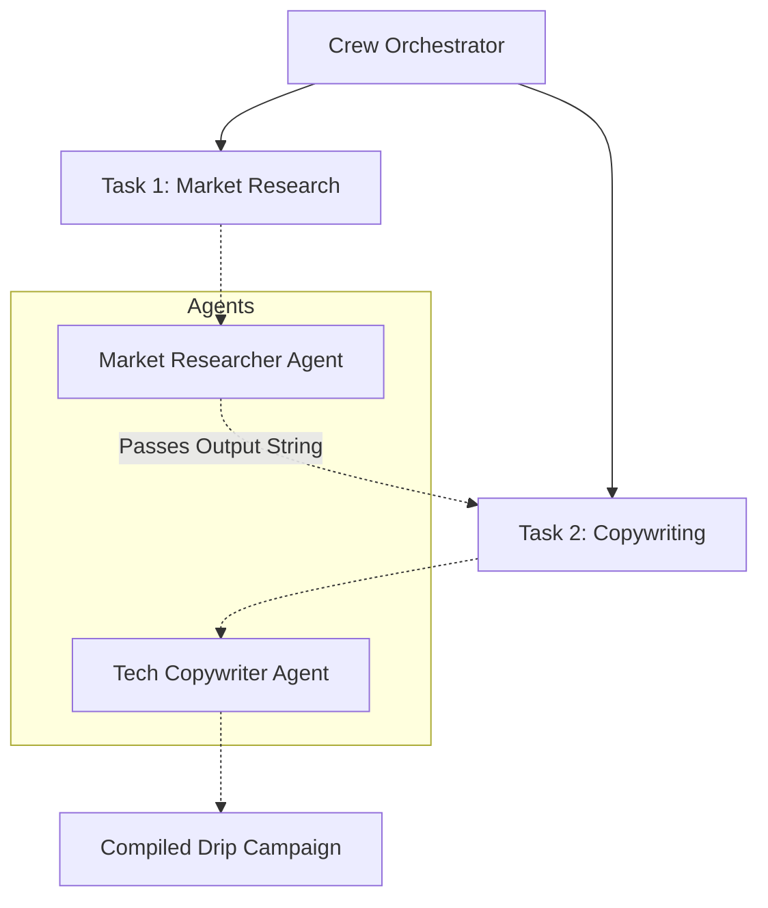

# Chapter 4: Specialized Open-Source Frameworks

Beyond the major tech giants, independent open-source projects are solving very specific AI Agent paradigms. These frameworks often command immense community popularity.

---

## 1. CrewAI

### Overview
CrewAI is an incredibly popular framework designed specifically for orchestrating role-playing AI agents. You assemble a "Crew" of agents, give them specific backgrounds, and watch them execute hierarchical or sequential tasks.

### The Problem We Are Solving 
**Automated Marketing Campaign Creation in Startups.**
A boutique agency needs to generate multi-faceted ad campaigns rapidly. Building complex LangGraph architecture with nodes and edges takes weeks. They want a framework where they can speak in "Plain English" to define who the team members are (A Researcher, a Writer) and just hand them a list of tasks to execute collaboratively. To solve this, we need an abstraction that maps "Roles and Goals" directly into multi-agent workflows.

### The Solution (Code Reference)
> 📁 **View the executable code here:** [`Code_Examples/Chapter4_CrewAI_Marketing.py`](./Code_Examples/Chapter4_CrewAI_Marketing.ipynb)

We define the Agents, define the Tasks natively in Python, assemble them into a Crew, and instruct them to execute sequentially, handling all internal state management silently.

### Advantages & Disadvantages
**Advantages:**
- **Exceptionally Intuitive API**: Allows product managers and prompt engineers to formulate team structures with near-zero software engineering friction.
- **Dynamic Context Passing**: Automatically handles passing the output from one agent’s task into the input of the next agent's task natively.
- **Rapid Prototyping**: Excellent for creative text generation out-of-the-box.

**Disadvantages:**
- **Lack of Deterministic Control**: Since agents operate largely on their system prompts instead of strict coded execution paths, they can be highly prone to erratic deviations or repetitive loops.
- **Production Scalability**: Very difficult to scale gracefully horizontally compared to independent LangGraph microservices.

---

## 2. SmolAgents (Hugging Face)

### Overview
A radically minimalist Python library from Hugging Face that aggressively prioritizes lightweight execution and LLM Code-generation.

### The Problem We Are Solving 
**Fast, Cost-Effective Computational Processing.**
A hobbyist data scientist needs a lightweight agent to compute complex compounding financial math, but standard LLMs fail at math inherently. Furthermore, they don't want to export their raw data to OpenAI's expensive API. They need a system that pulls a free, open-source model which forces the agent to *write local python code to solve math problems* rather than trying to guess the answer.

### The Solution (Code Reference)
> 📁 **View the executable code here:** [`Code_Examples/Chapter4_SmolAgents_Math.py`](./Code_Examples/Chapter4_SmolAgents_Math.ipynb)

By leveraging SmolAgents, the agent's absolute default behavior is to output executable python blocks. The framework runs the block and returns the exact math answer perfectly reliably.

### Advantages & Disadvantages
**Advantages:**
- **Code-First Architecture**: Fundamentally avoids LLM math-hallucinations by enforcing code execution as a core primitive.
- **Extremely Minimalist**: The source code is thin, reducing bloat, and making the underlying mechanics extremely easy to audit.
- **Hugging Face Synced**: Best-in-class integration with thousands of completely free models available on the HF Hub.

**Disadvantages:**
- **Scope limitation**: Not designed to orchestrate complex corporate workflows, RAG systems, or deep API routing logic.
- **Tooling Constraints**: Smaller built-in tool library compared to LangChain plugins.

---

*(Other specialized frameworks include **LlamaIndex Workflows** for deep asynchronous document processing, and **Letta** for OS-level infinite memory retention).*
