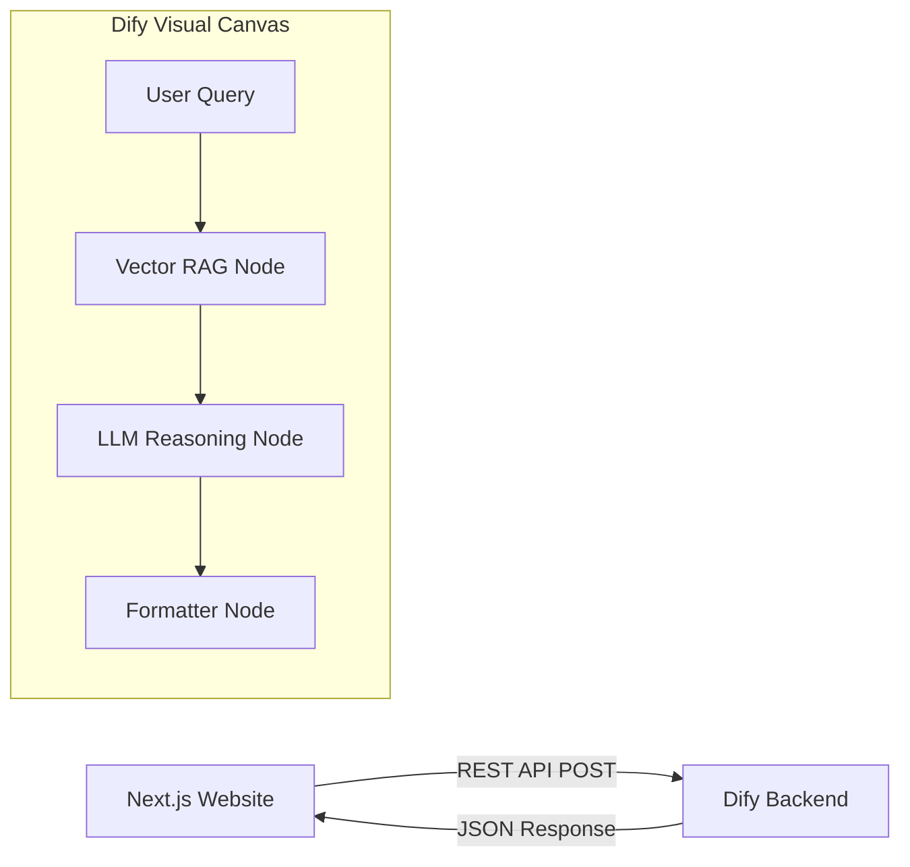

# Chapter 5: Enterprise, Low-Code, and No-Code Platforms

The transition from code-heavy Python SDKs to scalable, visual workflow builders allows business operations, non-technical founders, and enterprise teams to deploy AI logic rapidly and securely.

While these platforms are "low code" via the UI, they are predominantly consumed by frontend developers via robust REST APIs.

---

## 1. Dify

### Overview
Dify provides a visual canvas web-interface for building agents. You drag and drop nodes, define prompt templates, test the output, and attach vector databases all through a sleek UI. 

### The Problem We Are Solving 
**Bridging Non-Tech Product Managers with Frontend Engineering.**
A non-technical product manager wants to design an intricate, 15-step "Lead Qualification Agent" that references pricing PDFs, and wants to A/B test prompts easily. If developers write this in raw Python (LangChain), the PM has to open Pull Requests just to tweak a prompt. We need a system where the PM manages the Agent visually, and the Frontend Developer simply embeds the final AI output into the company Website.

### The Solution (Code Reference)
> 📁 **View the executable code here:** [`Code_Examples/Chapter5_Dify_API.py`](./Code_Examples/Chapter5_Dify_API.py)

We solve this by using Dify as a visual "Backend-as-a-Service". The developer executes a simple REST API POST call from their Next.js/Python server to interact with the PM's visually completed Agent.

### Advantages & Disadvantages
**Advantages:**
- **Workflow Decoupling**: Separation of concerns allows prompt engineers to iterate independently of software engineers, vastly speeding up iteration.
- **Visual Clarity**: Drag-and-drop RAG and workflow nodes make tracking complex logic incredibly easy compared to reading 500 lines of python code.
- **Multi-Model**: Instantly swap the engine from OpenAI to local HuggingFace models using dropdown menus.

**Disadvantages:**
- **Infrastructure Overhead**: Self-hosting Dify requires maintaining Postgres, Redis, Vector Databases, and dozens of Docker containers.
- **Granular Flexibility**: Lacks the deep deterministic low-level control of writing custom edge constraints natively in Python.

---

## 2. Zapier Central & n8n

### Overview
Traditional automation pioneers have embedded Agents forcefully into their DNA. 
- **Zapier Central**: Connects AI to 6,000+ app integrations via English commanding.
- **n8n**: A more technical, self-hostable open-source visual workflow automation tool allowing LLM triggers.

### The Problem We Are Solving 
**Asynchronous Enterprise SaaS Data Routing.**
A company handles thousands of incoming support desk emails. They need an automated agent that reads an email when it arrives, assesses the emotional sentiment (Angry vs Calm), and if "Angry", immediately routes an alert to a specific Slack channel. Solving this by building a background Python queue worker from scratch is tedious. We need a visual tool designed natively for asynchronous event processing.

### The Solution (Code Reference)
> 📁 **View the executable code here:** [`Code_Examples/Chapter5_n8n_Webhook.sh`](./Code_Examples/Chapter5_n8n_Webhook.sh)

We solve this using **n8n Webhooks**. An n8n developer strings a webhook node visually to an AI node. External systems just POST a payload to the webhook, and the visual Agent UI takes over automatically from there.

### Advantages & Disadvantages
**Advantages:**
- **Unrivaled Integrations**: The sheer volume of pre-configured API connectors to services like Salesforce, Jira, and Slack is unparalleled.
- **Event-Driven**: Automatically built to sleep and wake-up based on asynchronous hooks (emails arriving, rows updating in a spreadsheet).
- **Accessibility**: Nearly zero formal backend code required.

**Disadvantages:**
- **Cost at Scale**: Hosted Zapier execution charges per "task run", which becomes prohibitively expensive at enterprise scales.
- **Weak for Deep Reasoning**: While great for shuffling data between apps, they are generally poor at complex, multi-agent cyclical reasoning loops compared to dedicated Agent SDKs like LangGraph.
